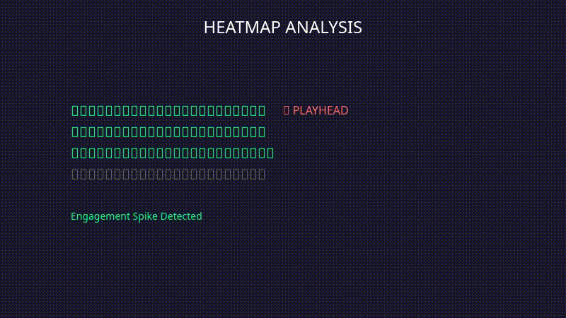
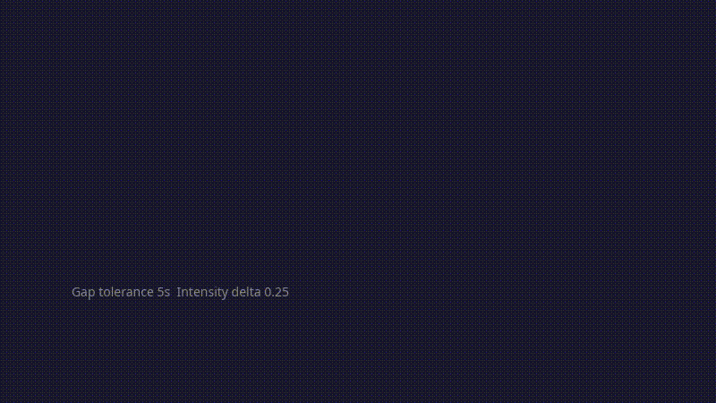
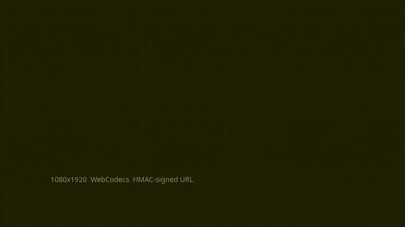
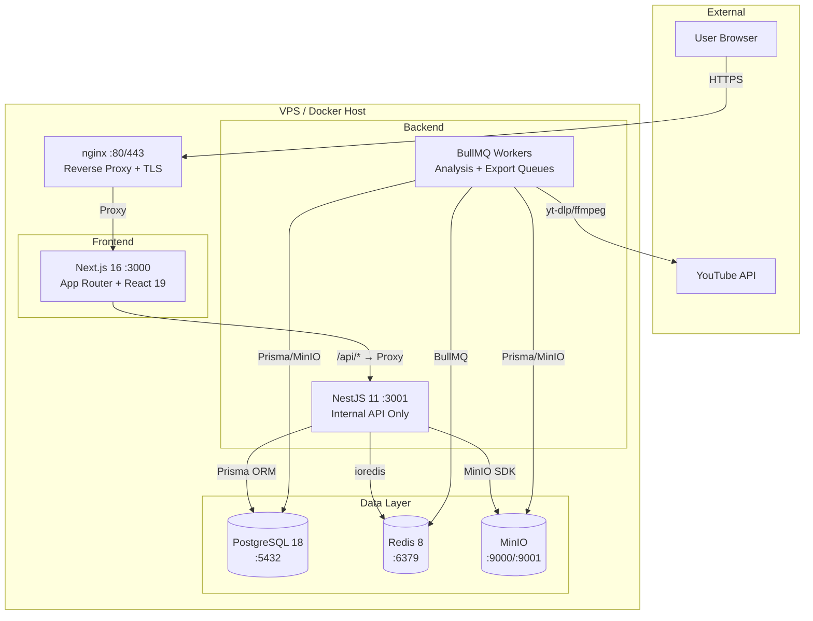

<p align="center">
  
</p>

> Find what viewers actually rewatch — then make it beautiful.

[](https://github.com/ahMEDhat-7/SpikeClip/actions/workflows/ci.yml)
[](https://www.typescriptlang.org/)
[](https://nodejs.org/)
[](LICENSE)

**SpikeClip extracts the most-replayed moments from YouTube videos using *actual viewer heatmap data* — not AI guesses.** It detects spikes in audience replay behavior and reformats those moments into vertical shorts ready for TikTok, YouTube Shorts, and Instagram Reels.

Unlike AI-guessing tools (OpusClip, Vexub, etc.), SpikeClip is built on the engagement signal YouTube already collects: the heatmap that shows exactly where viewers rewatched. The result is a clip selection you can defend with data, not vibes.

---

## 🎬 See It In Action

| Pipeline Stage | Preview |
|----------------|---------|
| **Heatmap Analysis** — Real viewer engagement with animated playhead |  |
| **Scene Detection** — Spike-merging algorithm clusters high-engagement moments |  |
| **Clip Studio → Export** — Captions, music, templates, vertical 9:16 output |  |

> **Live demo:** [spikeclip.dev](https://spikeclip.dev) (or run locally in 4 commands — see [Quick Start](#-quick-start))

---

## ✨ Key Features

| Category | Features |
|----------|----------|
| **🎯 Data-Driven Selection** | Real heatmap data via `yt-dlp` · Spike Merging Algorithm v2 (5s gap tolerance, 0.25 intensity delta) · 3–60s configurable clip duration · Top-N scene ranking |
| **🎨 Clip Studio Editor** | Multi-track timeline (OpenReel-based) · SRT/drawtext captions · Background music with fades · Curated templates (kinetic typography, split-screen, POV, collages) · WebCodecs/WebGPU in-browser rendering |
| **📱 Multi-Platform Export** | Single download → 9:16 crop → keyframe-accurate cuts → TikTok / YouTube Shorts / Instagram Reels ready · HMAC-signed downloads (no public buckets) |
| **👥 Accounts & Tiers** | Google OAuth 2.0 · httpOnly JWT cookies · Free (3 analyses/mo, 3 scenes) · Pro (unlimited, 10 scenes) · Team (unlimited, 25 scenes) · Stripe subscriptions |
| **⚙️ Production Backend** | Clean/hexagonal architecture (NestJS 11) · BullMQ workers · PostgreSQL 18 + Redis 8 + MinIO · Sentry · Rate limiting · Structured logging (Pino) |

---

## 🏗 Architecture Overview



**Key architectural decisions:**
- **nginx** is the only public entry point (terminates TLS, proxies to web)
- **Next.js** handles all user-facing concerns; proxies `/api/*` internally to NestJS API
- **NestJS API** is the single backend gateway — all data access flows through it (web never touches DB/Redis/MinIO directly)
- **Workers** run async jobs (heatmap analysis, clip export) via BullMQ/Redis queues
- **PostgreSQL, Redis, MinIO** are only reachable from the API layer

---

## 🔄 How It Works

### Analysis Pipeline (6 Stages)

| Stage | Description |
|-------|-------------|
| **01 — Submit** | Paste a YouTube URL. Metadata + heatmap extracted via `yt-dlp`. |
| **02 — Analyze** | Per-second engagement scores computed from heatmap data. |
| **03 — Detect** | Canonical spike-merging algorithm clusters high-engagement moments into scenes (3–60s). |
| **04 — Score** | Scenes ranked by viewer rewatch intensity — highest replay = best clip. |
| **05 — Visualize** | Interactive heatmap renders with detected scenes highlighted + clickable timestamps. |
| **06 — Decide** | User reviews ranked scenes and picks moments for Clip Studio. |

### Clip Studio Pipeline (4 Stages)

| Stage | Description |
|-------|-------------|
| **01 — Analyze** | Paste URL → get heatmap with per-second engagement scores. |
| **02 — Select** | Review detected scenes ranked by viewer rewatch intensity. |
| **03 — Edit** | Add captions (SRT/drawtext), layer background music with fades, apply curated templates. |
| **04 — Export** | Download vertical clips (9:16, 1080×1920) ready for TikTok, Shorts, Reels. |

```text
POST /api/jobs  →  yt-dlp extracts metadata + heatmap
  →  HeatmapWorker runs canonical merge algorithm → scenes saved
  →  Frontend polls GET /api/jobs/:id → renders interactive heatmap
        ↓
POST /api/jobs/:id/export  →  Clip rows created + export jobs enqueued
  →  ClipWorker: download section → crop to 9:16 → overlay captions →
     apply template effects → mix music → upload to MinIO
  →  Clips served via HMAC-signed API URLs (never a public bucket)
```

---

## 🚀 Quick Start

### Prerequisites

- **Node.js** ≥ 22 (LTS)
- **pnpm** 9.x
- **Docker** + Docker Compose v2
- **yt-dlp** — `pip install yt-dlp`
- **FFmpeg** — `apt install ffmpeg` / `brew install ffmpeg`

### 1. Clone & Install

```bash
git clone git@github.com:ahMEDhat-7/SpikeClip.git
cd SpikeClip
pnpm install          # postinstall runs `prisma generate` automatically
```

### 2. Start Infrastructure

```bash
./scripts/dev.sh
```

Starts Postgres (5432), Redis (6379), and MinIO (9000/9001) in Docker.

### 3. Configure Environment

```bash
cp .env.example apps/api/.env
```

Set your **Google OAuth credentials** at minimum (the UI and Browse pages work without them; analysis/export require a signed-in user).

### 4. Migrate & Run

```bash
pnpm --filter @spikeclip/api prisma:migrate
pnpm dev
```

| Service | URL |
|---------|-----|
| Frontend | http://localhost:3000 |
| Swagger API Docs | http://localhost:3001/api/docs |

> A seeded test user (`test@spikeclip.dev`) is available via `pnpm --filter @spikeclip/api prisma:seed` for manual testing without Google OAuth.

---

## 📁 Project Structure

```
SpikeClip/
├── apps/
│   ├── api/            # NestJS 11 backend (internal) — clean/hexagonal architecture
│   │   └── src/
│   │       ├── domain/          # entities, value objects, repository interfaces, services
│   │       ├── application/      # use-cases + DTOs
│   │       ├── infrastructure/   # Prisma, auth, external (yt-dlp/ffmpeg), storage, workers
│   │       └── presentation/     # controllers, filters, interceptors
│   └── web/            # Next.js 16 frontend (public)
│       └── src/
│           ├── app/             # App Router pages (studio, dashboard, login, ...)
│           ├── application/      # hooks + providers (API client, auth, studio)
│           ├── domain/           # entities, ports, data
│           ├── infrastructure/    # API clients (auth, job)
│           └── presentation/      # components (studio, heatmap, scenes, clips)
├── packages/
│   └── shared/         # shared types + the canonical spike-merging algorithm
├── deploy/             # VPS deployment (systemd, nginx, scripts)
├── docker/             # Nginx config for Docker + CI compose
├── scripts/            # dev.sh, prod.sh
├── docs/               # PRD, plan, tasks
├── media/              # README assets (animations, screenshots)
└── docker-compose.yml  # Full stack (all services)
```

---

## 🔐 Authentication & Tiers

**Google OAuth 2.0 only.** Sessions are cookie-based JWTs (`httpOnly`).

| Endpoint | Description |
|----------|-------------|
| `GET /api/auth/google` | Redirect to Google consent |
| `GET /api/auth/google/callback` | Sets session cookie |
| `POST /api/auth/logout` | Clears cookie |
| `GET /api/auth/me` | Current user |

| Tier | Analyses/Month | Scenes/Analysis |
|------|----------------|-----------------|
| Free | 3 | 3 |
| Pro | Unlimited | 10 |
| Team | Unlimited | 25 |

Unlimited tiers store `analysesLimit = -1`.

---

## 🧪 Testing & CI

```bash
pnpm test                              # all unit tests (shared + api + web)
pnpm --filter @spikeclip/api test:e2e # e2e (needs docker compose up)
```

**CI Pipeline (8 jobs in 4 phases):**

| Phase | Jobs |
|-------|------|
| **1. Code Quality** | Lint (`tsc --noEmit`), Prisma Validate, Unit Tests (shared + api), Security Audit |
| **2. Docker Build** | Base Image (ffmpeg + yt-dlp), API Image, Web Image (with `NEXT_PUBLIC_*` build args) |
| **3. Integration** | Full stack connectivity check (Postgres → Redis → MinIO → API → Web) |
| **4. Deploy** | Push to Docker Hub (on push to main/develop only) |

> **Note:** `lint` = `tsc --noEmit` per package (web uses `tsconfig.lint.json`). No ESLint config — type-checking is the lint step.

---

## 📚 Documentation

| Document | Description |
|----------|-------------|
| [API Reference](API.md) | Endpoints, request/response examples |
| [Database Schema](SCHEMA.md) | User, Job, Clip tables |
| [Algorithm](ALGORITHM.md) | Spike detection pipeline |
| [Deployment](DEPLOYMENT.md) | Local dev + VPS production |
| [Contributing](CONTRIBUTING.md) | Style, git + PR conventions |
| [Security](SECURITY.md) | Practices + vulnerability reporting |

---

## 🛠 Editing Engine & OpenReel Integration

SpikeClip's Clip Studio editing engine is being rebuilt on the open-source **[OpenReel](https://openreel.video)** architecture ([MIT](https://github.com/Augani/openreel-video), [github.com/Augani/openreel-video](https://github.com/Augani/openreel-video)):

- **Non-destructive multi-track timeline** as the single source of truth (replacing the per-scene flat `StudioAction[]` list)
- **Typed editing-tool registry** — every edit (manual *or* AI) is one undoable, typed command through the same surface
- **Model-agnostic AI agent** — bring OpenAI / Anthropic / local models; plans via dry-run and executes tools, with "undo the whole turn"
- **Hybrid rendering** — the server keeps YouTube ingest (`yt-dlp`), proxy/transcode, and storage (MinIO); compositing and export move to in-browser **WebCodecs / WebGPU** (mirroring OpenReel's engine), with server-side `ffmpeg` as a heavy-transcode fallback

This keeps SpikeClip's data-driven heatmap selection while giving it a professional, agent-native editing core. `StudioAction` remains as a legacy/translation layer during the transition.

---

## 📄 License

[MIT](LICENSE)